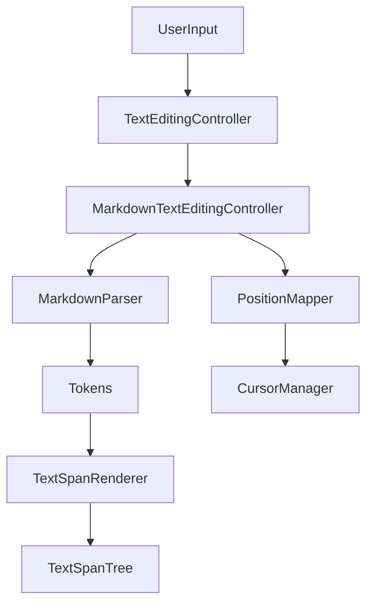

# WYSIWYG Editor Internals

The core feature of Asterisk is its WYSIWYG (What You See Is What You Get) markdown editor. Unlike traditional split-pane editors, Asterisk attempts to render markdown styling *in-place* while you type, optionally hiding the syntax characters (like `**` or `#`) when you aren't editing that specific line.

## Core Concepts

The editor is built on top of a customized `TextEditingController` called `MarkdownTextEditingController`. It intercepts text changes and rebuilds the standard Flutter `TextSpan` tree to apply styling.

### Two Rendering Modes

1.  **Visible Syntax ("Raw" but styled)**
    *   All characters are visible.
    *   Markdown syntax (e.g., `**`) is styled subtly (gray color).
    *   Content is styled boldly/italicized etc.
    *   This maps 1:1 with the underlying text buffer.

2.  **Hidden Syntax (Typora-style)**
    *   Markdown syntax characters are **stripped** from the render tree.
    *   Only the content is shown (styled).
    *   Syntax reappears when the cursor moves into that range (partially implemented via `CursorManager`).
    *   **Challenge**: The "Visual" position (what the user clicks) does NOT match the "Raw" position (the string index).

## Architecture

## Key Classes

### 1. [MarkdownParser](../lib/services/markdown_parser.dart)
A regex-based tokenizer. It scans the raw text and produces a list of `MarkdownToken`s.
*   **Input**: `String` (whole document)
*   **Output**: `List<MarkdownToken>`
*   **Strategy**: It runs multiple passes for different block/inline elements. It sorts tokens by position and handles nesting by priority (e.g., Code > Bold > Italic).

### 2. [TextSpanRenderer](../lib/services/text_span_renderer.dart)
Converts `MarkdownToken`s into Flutter `TextSpan` objects.
*   **Visible Syntax Mode**: Syntax characters are wrapped in a span with a subtle style.
*   **Hidden Syntax Mode**: Syntax characters are *omitted* from the span tree entirely.

### 3. [MarkdownTextEditingController](../lib/pages/main_page/panes/wysiwyg_editing_pane.dart)
The glue that holds it all together.
*   Overrides `buildTextSpan`.
*   Decides which rendering mode to use.
*   Updates the `PositionMapper` when text changes.

### 4. [PositionMapper](../lib/services/position_mapper.dart) & [CursorManager](../lib/services/cursor_manager.dart)
These are critical for the **Hidden Syntax** mode.
*   **Problem**: If the raw text is `**Bold**` (length 8) but we render `Bold` (length 4), and the user clicks after the 'd', Flutter thinks they clicked index 4. The actual text buffer index is 7 (before the last `*`).
*   **Solution**: `PositionMapper` maintains a mapping between visual offsets and raw offsets.
    *   `visualToRaw(int visibleIndex)`
    *   `rawToVisible(int rawIndex)`
*   `CursorManager` uses this mapping to adjust the selection handles and handle tap events, ensuring edits happen at the correct place in the string.

## Implementing New Syntax

To add support for a new markdown feature (e.g., Highlight `==text==`):

1.  **Update `MarkdownParser`**:
    *   Add a regex pattern to `_patterns`.
    *   Add a finder method (e.g., `_findHighlight`).
    *   Call it in `parseText`.
2.  **Update `TextSpanRenderer`**:
    *   Add a style getter (e.g., `getHighlightStyle`).
    *   Update `_createSpanForToken` to handle the new token type.
    *   Define syntax characters in `_getSyntaxCharsForToken`.
3.  **Test**: Verified in both visible and hidden syntax modes.
