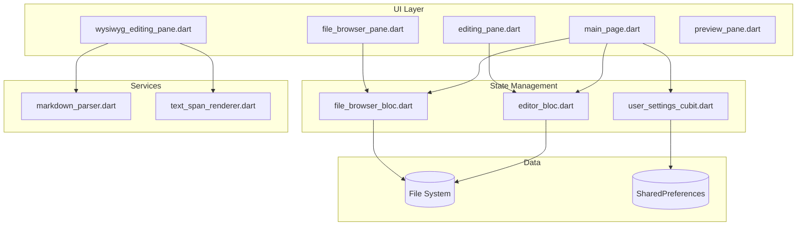
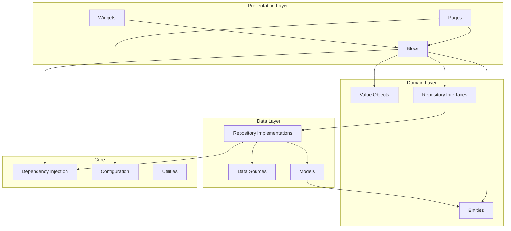
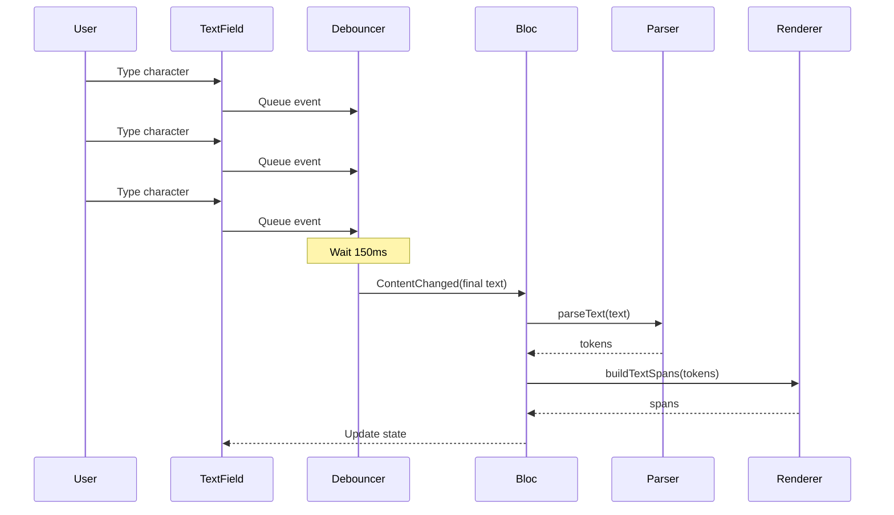

# Codebase Optimization Roadmap
## Asterisk Editor - Comprehensive Analysis & Actionable Plan

---

## Executive Summary

This document provides a comprehensive analysis of the Asterisk Editor codebase with specific focus on enhancing **readability**, **boosting performance**, and ensuring **long-term maintainability**. The analysis identifies key areas for improvement and provides actionable refactoring techniques, design patterns, and architectural improvements.

---

## 1. Current Architecture Overview

### 1.1 Project Structure
```
lib/
├── bloc/
│   ├── editor/ (Bloc pattern for editor state)
│   ├── file_browser/ (Bloc pattern for file navigation)
│   └── user_settings/ (Cubit for settings)
├── pages/
│   ├── main_page/ (Main editor interface)
│   │   └── panes/ (Split panes: editor, preview, file browser)
│   └── settings_page/
├── services/
│   ├── markdown_parser.dart (Regex-based markdown parsing)
│   └── text_span_renderer.dart (TextSpan generation)
├── widgets/
│   └── file_list_item.dart
└── misc/ (Themes, utilities)
```

### 1.2 Technology Stack
- **Framework**: Flutter (Material 3)
- **State Management**: flutter_bloc (Bloc/Cubit pattern)
- **Dependencies**: markdown_widget, flutter_markdown, multi_split_view, rxdart
- **Platform**: Cross-platform (Android, iOS, Linux, macOS, Windows)

---

## 2. Readability Improvements

### 2.1 Code Organization Issues

#### Issue 1: Mixed Concerns in [`main_page.dart`](lib/pages/main_page/main_page.dart)
**Problem**: The [`_HomePageState`](lib/pages/main_page/main_page.dart:22) class handles multiple responsibilities:
- UI layout with split panes
- Controller management (5+ controllers)
- Bloc state synchronization
- Keyboard shortcuts
- Mode switching logic

**Impact**: Difficult to test, modify, or understand individual behaviors.

**Refactoring Solution**: Extract into smaller, focused widgets using the **Composition Pattern**.

```dart
// Proposed structure:
class HomePage extends StatelessWidget {
  @override
  Widget build(BuildContext context) {
    return Scaffold(
      appBar: _buildAppBar(context),
      body: EditorLayout(
        fileBrowserPane: FileBrowserPaneWidget(),
        editorPane: EditingPaneWidget(...),
        wysiwygPane: WysiwygEditorWidget(...),
        previewPane: PreviewPaneWidget(...),
        selectedMode: context.watch<EditorModeCubit>().state,
      ),
    );
  }
}

class EditorLayout extends StatelessWidget {
  // Handle split view logic here
}

class EditorAppBar extends StatelessWidget {
  // Handle app bar actions and title
}
```

**Benefits**:
- Each widget has a single responsibility
- Easier to unit test individual components
- Improved code navigation and understanding

---

#### Issue 2: Large Methods in [`text_span_renderer.dart`](lib/services/text_span_renderer.dart)
**Problem**: The [`buildTextSpanWithVisibleSyntax`](lib/services/text_span_renderer.dart:77) method (63 lines) handles multiple concerns:
- Token iteration
- Syntax character extraction
- Span creation
- Style merging

**Refactoring Solution**: Apply **Extract Method** and **Strategy Pattern**.

```dart
// Proposed refactoring:
class TextSpanRenderer {
  List<TextSpan> _buildVisibleSyntaxSpans(
    String text,
    List<MarkdownToken> tokens,
    TextStyle baseTextStyle,
  ) {
    final spans = <TextSpan>[];
    int lastEnd = 0;
    final syntaxStyle = _createSyntaxStyle(baseTextStyle);

    for (final token in tokens) {
      spans.addAll(_buildUnstyledText(text, lastEnd, token.start, baseTextStyle));
      spans.addAll(_buildTokenWithSyntax(token, baseTextStyle, syntaxStyle));
      lastEnd = token.end;
    }

    spans.addAll(_buildUnstyledText(text, lastEnd, text.length, baseTextStyle));
    return spans;
  }

  List<TextSpan> _buildUnstyledText(
    String text,
    int start,
    int end,
    TextStyle style,
  ) {
    if (start >= end) return [];
    return [TextSpan(text: text.substring(start, end), style: style)];
  }

  List<TextSpan> _buildTokenWithSyntax(
    MarkdownToken token,
    TextStyle baseStyle,
    TextStyle syntaxStyle,
  ) {
    final syntaxChars = _getSyntaxCharsForToken(token);
    final styledSpan = _createSpanForToken(token);
    
    return [
      if (syntaxChars.prefix.isNotEmpty)
        TextSpan(text: syntaxChars.prefix, style: syntaxStyle),
      TextSpan(
        text: styledSpan.text,
        style: baseStyle.merge(styledSpan.style),
        children: styledSpan.children,
        recognizer: styledSpan.recognizer,
      ),
      if (syntaxChars.suffix.isNotEmpty)
        TextSpan(text: syntaxChars.suffix, style: syntaxStyle),
    ];
  }
}
```

**Benefits**:
- Each method has a clear, single purpose
- Easier to test individual behaviors
- Improved method naming for self-documentation

---

#### Issue 3: String-Based Mode Handling in [`main_page.dart`](lib/pages/main_page/main_page.dart)
**Problem**: Using string literals for editor modes (`'Split Pane'`, `'Plain Editor'`, etc.) is error-prone and not type-safe.

```dart
// Current implementation:
final List<String> selectableModes = [
  'Split Pane',
  'Plain Editor',
  'WYSIWYG Editor',
  'Preview Only',
];
String selectedMode = 'Split Pane';
```

**Refactoring Solution**: Use **Enum Extension Pattern**.

```dart
// Proposed implementation:
enum EditorViewMode {
  splitPane,
  plainEditor,
  wysiwygEditor,
  previewOnly;

  String get displayName {
    switch (this) {
      case EditorViewMode.splitPane: return 'Split Pane';
      case EditorViewMode.plainEditor: return 'Plain Editor';
      case EditorViewMode.wysiwygEditor: return 'WYSIWYG Editor';
      case EditorViewMode.previewOnly: return 'Preview Only';
    }
  }

  EditorMode toEditorMode() {
    switch (this) {
      case EditorViewMode.splitPane: return EditorMode.plain;
      case EditorViewMode.plainEditor: return EditorMode.plain;
      case EditorViewMode.wysiwygEditor: return EditorMode.wysiwyg;
      case EditorViewMode.previewOnly: return EditorMode.preview;
    }
  }
}
```

**Benefits**:
- Type-safe mode handling
- Compile-time error detection
- Auto-completion support in IDEs
- Centralized mode logic

---

### 2.2 Naming Conventions Improvements

#### Issue 4: Ambiguous Variable Names in [`editor_bloc.dart`](lib/bloc/editor/editor_bloc.dart)
**Problem**: Variables like `_originalContent` don't clearly indicate their purpose.

**Refactoring Solution**: Use more descriptive names following the **Intention-Revealing Names** principle.

```dart
// Current:
String _originalContent = '';

// Proposed:
String _lastSavedContent = '';
String _contentAtFileLoad = '';

// Or better:
class EditorBloc extends Bloc<EditorEvent, EditorState> {
  final FileContentTracker _contentTracker = FileContentTracker();
  // ...
}

class FileContentTracker {
  String _savedSnapshot = '';
  String _loadedSnapshot = '';

  bool hasUnsavedChanges(String currentContent) {
    return currentContent != _savedSnapshot;
  }

  void updateSavedSnapshot(String content) {
    _savedSnapshot = content;
  }
}
```

---

### 2.3 Documentation Improvements

#### Issue 5: Missing or Incomplete Documentation
**Problem**: Many public methods lack documentation explaining their purpose, parameters, and return values.

**Refactoring Solution**: Add comprehensive documentation using **Dart Doc Comments**.

```dart
/// Parses markdown text and returns a list of tokens representing
/// markdown elements (headers, bold, italic, code, links, lists).
///
/// Tokens are sorted by start position and non-overlapping.
/// Inline styles are parsed first, followed by block elements.
///
/// Example:
/// ```dart
/// final parser = MarkdownParser();
/// final tokens = parser.parseText('# Hello **world**');
/// // Returns tokens for header and bold text
/// ```
///
/// [text] The markdown text to parse.
///
/// Returns a sorted list of [MarkdownToken] objects.
///
/// Throws no exceptions - always returns a valid list (may be empty).
List<MarkdownToken> parseText(String text) {
  // Implementation
}
```

---

## 3. Performance Optimizations

### 3.1 Parsing Performance

#### Issue 6: Inefficient Regex Parsing in [`markdown_parser.dart`](lib/services/markdown_parser.dart)
**Problem**: The [`parseText`](lib/services/markdown_parser.dart:66) method runs multiple regex passes over the entire text:
- Inline styles (4 patterns)
- Links (1 pattern)
- Headers (1 pattern)
- Lists (2 patterns)

For large documents, this causes O(n*m) complexity where n is text length and m is pattern count.

**Refactoring Solution**: Implement **Single-Pass Parser** with **Lazy Evaluation**.

```dart
// Proposed implementation using a single-pass lexer:
class MarkdownLexer {
  final List<MarkdownPattern> _patterns;
  
  MarkdownLexer() : _patterns = [
    MarkdownPattern('header', RegExp(r'^(#{1,6})\s+(.+)$', multiLine: true)),
    MarkdownPattern('bold', RegExp(r'\*\*(.+?)\*\*')),
    MarkdownPattern('italic', RegExp(r'(?<!\*)\*(?!\*)(.+?)(?<!\*)\*(?!\*)')),
    // ... other patterns
  ];

  List<MarkdownToken> parse(String text) {
    final tokens = <MarkdownToken>[];
    final scanner = StringScanner(text);
    
    while (!scanner.isDone) {
      bool matched = false;
      
      for (final pattern in _patterns) {
        if (scanner.scan(pattern.regex)) {
          tokens.add(pattern.createToken(scanner.lastMatch));
          matched = true;
          break;
        }
      }
      
      if (!matched) {
        scanner.readChar();
      }
    }
    
    return tokens;
  }
}
```

**Benefits**:
- Single pass through text: O(n) complexity
- Reduced memory allocations
- Better performance on large documents

---

#### Issue 7: Repeated Parsing in WYSIWYG Editor
**Problem**: [`WysiwygEditorWidget`](lib/pages/main_page/panes/wysiwyg_editing_pane.dart:54) parses text on every keystroke without debouncing.

**Refactoring Solution**: Implement **Debouncing with Caching**.

```dart
class CachedMarkdownParser {
  final MarkdownParser _parser;
  final int _cacheSize;
  final LRUCache<String, List<MarkdownToken>> _cache;
  
  CachedMarkdownParser({
    required MarkdownParser parser,
    int cacheSize = 10,
  }) : _parser = parser,
       _cacheSize = cacheSize,
       _cache = LRUCache(maxSize: cacheSize);

  List<MarkdownToken> parse(String text) {
    // Check cache first
    if (_cache.containsKey(text)) {
      return _cache[text]!;
    }
    
    // Parse and cache
    final tokens = _parser.parseText(text);
    _cache[text] = tokens;
    return tokens;
  }
}

// In WysiwygEditorWidget:
Timer? _debounceTimer;

void _onTextChanged(String text) {
  _debounceTimer?.cancel();
  _debounceTimer = Timer(const Duration(milliseconds: 150), () {
    // Only parse if text hasn't changed again
    if (_markdownController.text == text) {
      setState(() {
        // Trigger rebuild with new tokens
      });
    }
  });
}
```

**Benefits**:
- Reduced CPU usage during typing
- Smoother typing experience
- Cached results for repeated content

---

### 3.2 Rendering Performance

#### Issue 8: Inefficient TextSpan Building
**Problem**: [`TextSpanRenderer.buildTextSpanWithVisibleSyntax`](lib/services/text_span_renderer.dart:77) creates many intermediate objects for each render.

**Refactoring Solution**: Use **Object Pool Pattern** for TextSpan creation.

```dart
class TextSpanPool {
  final List<TextSpan> _pool = [];
  static const _maxPoolSize = 50;
  
  TextSpan acquire() {
    if (_pool.isNotEmpty) {
      return _pool.removeLast();
    }
    return TextSpan();
  }
  
  void release(TextSpan span) {
    if (_pool.length < _maxPoolSize) {
      // Reset span properties
      _pool.add(TextSpan(
        text: null,
        style: null,
        children: null,
        recognizer: null,
      ));
    }
  }
}

class TextSpanRenderer {
  final TextSpanPool _spanPool = TextSpanPool();
  
  List<TextSpan> buildTextSpans(String text, List<MarkdownToken> tokens) {
    final spans = <TextSpan>[];
    // Use pooled spans when possible
    // ...
    return spans;
  }
}
```

**Benefits**:
- Reduced garbage collection pressure
- Lower memory fragmentation
- Smoother scrolling in large documents

---

#### Issue 9: Unnecessary Rebuilds in [`main_page.dart`](lib/pages/main_page/main_page.dart)
**Problem**: Multiple [`BlocBuilder`](lib/pages/main_page/main_page.dart:144) widgets in the app bar cause unnecessary rebuilds.

**Refactoring Solution**: Use **BlocSelector** for granular state listening.

```dart
// Current: Rebuilds entire app bar on any state change
BlocBuilder<EditorBloc, EditorState>(
  builder: (context, state) => AppBar(...),
)

// Proposed: Only rebuild when title changes
BlocSelector<EditorBloc, EditorState, String>(
  selector: (state) {
    if (state is EditorLoaded) {
      final name = p.basename(state.currentFile.path);
      return state.isDirty ? '$name *' : name;
    }
    return 'Markdown Editor';
  },
  builder: (context, title) => AppBar(title: Text(title)),
)

// Separate selector for save button
BlocSelector<EditorBloc, EditorState, bool>(
  selector: (state) => state is EditorLoaded && state.isDirty,
  builder: (context, showSave) {
    return showSave
        ? IconButton(icon: Icon(Icons.save), onPressed: ...)
        : SizedBox.shrink();
  },
)
```

**Benefits**:
- Reduced widget rebuilds
- Better performance on state changes
- More efficient UI updates

---

### 3.3 File I/O Performance

#### Issue 10: Synchronous File Reading in [`editor_bloc.dart`](lib/bloc/editor/editor_bloc.dart)
**Problem**: File operations block the UI thread during loading/saving.

**Refactoring Solution**: Use **Isolate Pattern** for file I/O.

```dart
class FileIOService {
  static Future<String> readFile(String path) async {
    return await compute(_readFileIsolate, path);
  }
  
  static Future<void> writeFile(String path, String content) async {
    return await compute(_writeFileIsolate, {'path': path, 'content': content});
  }
  
  static String _readFileIsolate(String path) {
    return File(path).readAsStringSync();
  }
  
  static void _writeFileIsolate(Map<String, dynamic> params) {
    File(params['path']).writeAsStringSync(params['content']);
  }
}

// In EditorBloc:
Future<void> _onLoadFileRequested(
    LoadFileRequested event, Emitter<EditorState> emit) async {
  emit(const EditorLoading());
  try {
    final content = await FileIOService.readFile(event.file.path);
    _lastSavedContent = content;
    emit(EditorLoaded(
      currentFile: event.file,
      content: content,
      isDirty: false,
    ));
  } catch (e) {
    emit(EditorError("Failed to read file: ${e.toString()}"));
  }
}
```

**Benefits**:
- Non-blocking file operations
- Smoother UI during file operations
- Better user experience with large files

---

## 4. Maintainability Improvements

### 4.1 Error Handling

#### Issue 11: Inconsistent Error Handling
**Problem**: Some errors use `print()` statements, others emit error states.

**Current examples**:
- [`file_browser_bloc.dart:37`](lib/bloc/file_browser/file_browser_bloc.dart:37): `print("Error listing directory: $e");`
- [`file_browser_bloc.dart:81`](lib/bloc/file_browser/file_browser_bloc.dart:81): `print("Warning: Selected file ${event.file.path} not found...");`
- [`editor_bloc.dart:25`](lib/bloc/editor/editor_bloc.dart:25): `print("Warning: Cannot load ${event.file.path}...");`

**Refactoring Solution**: Implement **Centralized Logging Service**.

```dart
// Create: lib/services/logger.dart
enum LogLevel { debug, info, warning, error }

class AppLogger {
  static final AppLogger _instance = AppLogger._internal();
  factory AppLogger() => _instance;
  AppLogger._internal();

  final List<LogEntry> _logs = [];
  final StreamController<LogEntry> _logController = StreamController.broadcast();
  
  Stream<LogEntry> get logStream => _logController.stream;
  
  void debug(String message, [Object? error, StackTrace? stackTrace]) {
    _log(LogLevel.debug, message, error, stackTrace);
  }
  
  void info(String message, [Object? error, StackTrace? stackTrace]) {
    _log(LogLevel.info, message, error, stackTrace);
  }
  
  void warning(String message, [Object? error, StackTrace? stackTrace]) {
    _log(LogLevel.warning, message, error, stackTrace);
  }
  
  void error(String message, [Object? error, StackTrace? stackTrace]) {
    _log(LogLevel.error, message, error, stackTrace);
  }
  
  void _log(LogLevel level, String message, Object? error, StackTrace? stackTrace) {
    final entry = LogEntry(
      level: level,
      message: message,
      error: error,
      stackTrace: stackTrace,
      timestamp: DateTime.now(),
    );
    _logs.add(entry);
    _logController.add(entry);
    
    // Also print to console for development
    if (kDebugMode) {
      print('[${level.name.toUpperCase()}] $message');
      if (error != null) print('Error: $error');
      if (stackTrace != null) print(stackTrace);
    }
  }
}

class LogEntry {
  final LogLevel level;
  final String message;
  final Object? error;
  final StackTrace? stackTrace;
  final DateTime timestamp;
  
  LogEntry({
    required this.level,
    required this.message,
    this.error,
    this.stackTrace,
    required this.timestamp,
  });
}

// Usage:
final logger = AppLogger();
logger.warning("Cannot load file", null, null);
logger.error("Failed to save file", e, stackTrace);
```

**Benefits**:
- Consistent logging across the app
- Centralized log management
- Ability to add log persistence or remote logging
- Better debugging capabilities

---

### 4.2 Testing Infrastructure

#### Issue 12: No Test Files Present
**Problem**: The project lacks unit tests, widget tests, and integration tests.

**Refactoring Solution**: Establish **Testing Pyramid** with comprehensive test coverage.

```dart
// test/services/markdown_parser_test.dart
void main() {
  group('MarkdownParser', () {
    late MarkdownParser parser;
    
    setUp(() {
      parser = MarkdownParser();
    });
    
    test('should parse headers correctly', () {
      final tokens = parser.parseText('# Header 1');
      expect(tokens, hasLength(1));
      expect(tokens.first.type, equals('header'));
      expect(tokens.first.metadata['level'], equals(1));
    });
    
    test('should parse bold text', () {
      final tokens = parser.parseText('**bold text**');
      expect(tokens, hasLength(1));
      expect(tokens.first.type, equals('bold'));
      expect(tokens.first.content, equals('bold text'));
    });
    
    test('should handle nested markdown', () {
      final tokens = parser.parseText('# **Bold Header**');
      expect(tokens, hasLength(1));
      expect(tokens.first.type, equals('header'));
    });
  });
}

// test/bloc/editor/editor_bloc_test.dart
void main() {
  group('EditorBloc', () {
    late EditorBloc editorBloc;
    
    setUp(() {
      editorBloc = EditorBloc();
    });
    
    tearDown(() {
      editorBloc.close();
    });
    
    test('initial state is EditorInitial', () {
      expect(editorBloc.state, isA<EditorInitial>());
    });
    
    blocTest<EditorBloc, EditorState>(
      'emits EditorLoaded when LoadFileRequested is added',
      build: () => editorBloc,
      act: (bloc) => bloc.add(LoadFileRequested(File('test.md'))),
      expect: () => [
        isA<EditorLoading>(),
        isA<EditorLoaded>(),
      ],
    );
  });
}

// test/widgets/wysiwyg_editor_widget_test.dart
void main() {
  testWidgets('WysiwygEditorWidget renders toolbar buttons',
      (tester) async {
    await tester.pumpWidget(
      MaterialApp(
        home: WysiwygEditorWidget(
          controller: TextEditingController(),
          scrollController: ScrollController(),
          focusNode: FocusNode(),
        ),
      ),
    );
    
    expect(find.byIcon(Icons.format_bold), findsOneWidget);
    expect(find.byIcon(Icons.format_italic), findsOneWidget);
  });
}
```

**Benefits**:
- Confidence in code changes
- Early bug detection
- Living documentation
- Easier refactoring

---

### 4.3 Dependency Management

#### Issue 13: Unused or Redundant Dependencies
**Problem**: [`pubspec.yaml`](pubspec.yaml) includes multiple markdown packages that may have overlapping functionality:
- `markdown_widget: ^2.3.2+6`
- `flutter_markdown: ^0.7.7`
- `flutter_markdown_plus: ^1.0.3`

**Refactoring Solution**: Conduct **Dependency Audit** and consolidate.

```yaml
# Recommended approach:
dependencies:
  # Keep only one markdown rendering library
  flutter_markdown: ^0.7.7  # Well-maintained, official
  
  # Remove redundant packages
  # markdown_widget: ^2.3.2+6  # Remove
  # flutter_markdown_plus: ^1.0.3  # Remove
  
  # Keep custom parser/renderer for WYSIWYG
  # (already implemented in lib/services/)
```

**Benefits**:
- Reduced app size
- Fewer security vulnerabilities
- Simpler dependency tree
- Faster build times

---

### 4.4 Configuration Management

#### Issue 14: Hardcoded Values Throughout Codebase
**Problem**: Magic numbers and strings scattered across files:
- Divider thickness: `50` in [`main_page.dart:269`](lib/pages/main_page/main_page.dart:269)
- Font sizes: `16`, `20` in multiple files
- Timeout values: `300ms` (commented) in [`editor_bloc.dart:67`](lib/bloc/editor/editor_bloc.dart:67)

**Refactoring Solution**: Create **Centralized Configuration**.

```dart
// lib/config/app_config.dart
class AppConfig {
  // UI Constants
  static const double defaultFontSize = 16.0;
  static const double toolbarIconSize = 20.0;
  static const double dividerThickness = 1.0;
  static const double dividerIndent = 3.0;
  
  // Padding Constants
  static const double defaultPadding = 8.0;
  static const double editorPadding = 4.0;
  
  // Performance Constants
  static const Duration typingDebounce = Duration(milliseconds: 150);
  static const Duration saveDebounce = Duration(milliseconds: 500);
  
  // File Browser Constants
  static const int fileBrowserCacheSize = 100;
  static const List<String> supportedExtensions = ['.md', '.markdown', '.txt'];
  
  // Editor Constants
  static const int maxUndoHistory = 50;
  static const int autoSaveIntervalMinutes = 5;
}

// Usage:
child: TextField(
  style: TextStyle(fontSize: AppConfig.defaultFontSize),
  decoration: InputDecoration(
    contentPadding: EdgeInsets.all(AppConfig.defaultPadding),
  ),
)
```

**Benefits**:
- Single source of truth for constants
- Easy to adjust app-wide settings
- Consistent UI/UX
- Better maintainability

---

## 5. Design Patterns Implementation

### 5.1 Repository Pattern for File Operations

**Current State**: File operations scattered across Blocs.

**Proposed Implementation**:

```dart
// lib/repositories/file_repository.dart
abstract class FileRepository {
  Future<String> readFile(String path);
  Future<void> writeFile(String path, String content);
  Future<List<FileSystemEntity>> listDirectory(String path);
  Future<bool> fileExists(String path);
}

class LocalFileRepository implements FileRepository {
  @override
  Future<String> readFile(String path) async {
    final file = File(path);
    if (!await file.exists()) {
      throw FileNotFoundException(path);
    }
    return await file.readAsString();
  }
  
  @override
  Future<void> writeFile(String path, String content) async {
    final file = File(path);
    await file.writeAsString(content);
  }
  
  @override
  Future<List<FileSystemEntity>> listDirectory(String path) async {
    final directory = Directory(path);
    if (!await directory.exists()) {
      throw DirectoryNotFoundException(path);
    }
    return directory.list().toList();
  }
  
  @override
  Future<bool> fileExists(String path) async {
    return await File(path).exists();
  }
}

// Usage in Blocs:
class EditorBloc extends Bloc<EditorEvent, EditorState> {
  final FileRepository _fileRepository;
  
  EditorBloc(this._fileRepository) : super(const EditorInitial()) {
    on<LoadFileRequested>(_onLoadFileRequested);
  }
  
  Future<void> _onLoadFileRequested(
      LoadFileRequested event, Emitter<EditorState> emit) async {
    emit(const EditorLoading());
    try {
      final content = await _fileRepository.readFile(event.file.path);
      // ...
    } on FileNotFoundException catch (e) {
      emit(EditorError("File not found: ${e.path}"));
    }
  }
}
```

**Benefits**:
- Separation of concerns
- Easier to mock for testing
- Can switch implementations (e.g., cloud storage)
- Centralized error handling

---

### 5.2 Factory Pattern for Markdown Renderers

**Current State**: [`TextSpanRenderer`](lib/services/text_span_renderer.dart:9) created directly in widgets.

**Proposed Implementation**:

```dart
// lib/factories/renderer_factory.dart
abstract class RendererFactory {
  TextSpanRenderer createRenderer(BuildContext context);
}

class LightRendererFactory implements RendererFactory {
  @override
  TextSpanRenderer createRenderer(BuildContext context) {
    final theme = Theme.of(context);
    return TextSpanRenderer(
      baseStyle: theme.textTheme.bodyMedium ?? const TextStyle(fontSize: 16),
      headerColor: theme.textTheme.headlineMedium?.color,
      codeBackgroundColor: const Color(0xFFE0E0E0),
      linkColor: Colors.blue,
      listBulletColor: Colors.black87,
    );
  }
}

class DarkRendererFactory implements RendererFactory {
  @override
  TextSpanRenderer createRenderer(BuildContext context) {
    final theme = Theme.of(context);
    return TextSpanRenderer(
      baseStyle: theme.textTheme.bodyMedium ?? const TextStyle(fontSize: 16),
      headerColor: theme.textTheme.headlineMedium?.color,
      codeBackgroundColor: const Color(0xFF2D2D2D),
      linkColor: Colors.lightBlue,
      listBulletColor: Colors.white70,
    );
  }
}

class RendererFactoryProvider {
  static RendererFactory getFactory(BuildContext context) {
    final brightness = Theme.of(context).brightness;
    return brightness == Brightness.dark
        ? DarkRendererFactory()
        : LightRendererFactory();
  }
}
```

**Benefits**:
- Easy to add new renderer types
- Theme-aware renderer selection
- Cleaner widget code
- Better testability

---

### 5.3 Observer Pattern for File Changes

**Current State**: No file watching mechanism.

**Proposed Implementation**:

```dart
// lib/services/file_watcher.dart
class FileWatcher {
  final StreamController<FileChangeEvent> _controller = StreamController.broadcast();
  final Map<String, StreamSubscription<FileSystemEvent>> _subscriptions = {};
  
  Stream<FileChangeEvent> get events => _controller.stream;
  
  void watchFile(String path) {
    final file = File(path);
    final directory = file.parent;
    
    _subscriptions[path] = directory.watch(events: FileSystemEvent.all).listen((event) {
      if (event.path == path) {
        _controller.add(FileChangeEvent(
          path: path,
          type: _getEventType(event),
          timestamp: DateTime.now(),
        ));
      }
    });
  }
  
  void unwatchFile(String path) {
    _subscriptions[path]?.cancel();
    _subscriptions.remove(path);
  }
  
  FileChangeType _getEventType(FileSystemEvent event) {
    switch (event.type) {
      case FileSystemEvent.create: return FileChangeType.created;
      case FileSystemEvent.modify: return FileChangeType.modified;
      case FileSystemEvent.delete: return FileChangeType.deleted;
      case FileSystemEvent.move: return FileChangeType.moved;
      default: return FileChangeType.unknown;
    }
  }
  
  void dispose() {
    for (final sub in _subscriptions.values) {
      sub.cancel();
    }
    _controller.close();
  }
}

class FileChangeEvent {
  final String path;
  final FileChangeType type;
  final DateTime timestamp;
  
  FileChangeEvent({
    required this.path,
    required this.type,
    required this.timestamp,
  });
}

enum FileChangeType { created, modified, deleted, moved, unknown }

// Usage in Bloc:
class EditorBloc extends Bloc<EditorEvent, EditorState> {
  final FileWatcher _fileWatcher;
  StreamSubscription? _fileWatcherSubscription;
  
  EditorBloc(this._fileWatcher) : super(const EditorInitial()) {
    on<LoadFileRequested>(_onLoadFileRequested);
  }
  
  Future<void> _onLoadFileRequested(
      LoadFileRequested event, Emitter<EditorState> emit) async {
    // Watch the file for external changes
    _fileWatcher.watchFile(event.file.path);
    _fileWatcherSubscription = _fileWatcher.events.listen((change) {
      if (change.type == FileChangeType.modified) {
        add(ReloadFileRequested(event.file));
      }
    });
    
    // ... rest of load logic
  }
  
  @override
  Future<void> close() {
    _fileWatcherSubscription?.cancel();
    return super.close();
  }
}
```

**Benefits**:
- Automatic reload on external file changes
- Prevents data loss from external edits
- Better collaboration experience

---

### 5.4 Command Pattern for Undo/Redo

**Current State**: No undo/redo functionality.

**Proposed Implementation**:

```dart
// lib/commands/editor_command.dart
abstract class EditorCommand {
  String get description;
  void execute(TextEditingController controller);
  void undo(TextEditingController controller);
}

class InsertTextCommand implements EditorCommand {
  final String text;
  final int position;
  
  InsertTextCommand({required this.text, required this.position});
  
  @override
  String get description => 'Insert: "$text"';
  
  @override
  void execute(TextEditingController controller) {
    final currentText = controller.text;
    final newText = currentText.substring(0, position) + 
                    text + 
                    currentText.substring(position);
    controller.text = newText;
    controller.selection = TextSelection.collapsed(offset: position + text.length);
  }
  
  @override
  void undo(TextEditingController controller) {
    final currentText = controller.text;
    final newText = currentText.substring(0, position) + 
                    currentText.substring(position + text.length);
    controller.text = newText;
    controller.selection = TextSelection.collapsed(offset: position);
  }
}

class DeleteTextCommand implements EditorCommand {
  final String deletedText;
  final int position;
  
  DeleteTextCommand({required this.deletedText, required this.position});
  
  @override
  String get description => 'Delete: "$deletedText"';
  
  @override
  void execute(TextEditingController controller) {
    final currentText = controller.text;
    final newText = currentText.substring(0, position) + 
                    currentText.substring(position + deletedText.length);
    controller.text = newText;
    controller.selection = TextSelection.collapsed(offset: position);
  }
  
  @override
  void undo(TextEditingController controller) {
    final currentText = controller.text;
    final newText = currentText.substring(0, position) + 
                    deletedText + 
                    currentText.substring(position);
    controller.text = newText;
    controller.selection = TextSelection.collapsed(offset: position + deletedText.length);
  }
}

// lib/services/undo_manager.dart
class UndoManager {
  final List<EditorCommand> _undoStack = [];
  final List<EditorCommand> _redoStack = [];
  final int maxHistory;
  
  UndoManager({this.maxHistory = 50});
  
  void execute(EditorCommand command, TextEditingController controller) {
    command.execute(controller);
    _undoStack.add(command);
    _redoStack.clear();
    
    if (_undoStack.length > maxHistory) {
      _undoStack.removeAt(0);
    }
  }
  
  void undo(TextEditingController controller) {
    if (_undoStack.isEmpty) return;
    
    final command = _undoStack.removeLast();
    command.undo(controller);
    _redoStack.add(command);
  }
  
  void redo(TextEditingController controller) {
    if (_redoStack.isEmpty) return;
    
    final command = _redoStack.removeLast();
    command.execute(controller);
    _undoStack.add(command);
  }
  
  bool get canUndo => _undoStack.isNotEmpty;
  bool get canRedo => _redoStack.isNotEmpty;
}
```

**Benefits**:
- Complete undo/redo functionality
- Extensible command system
- Better user experience
- Professional editor features

---

## 6. Architectural Improvements

### 6.1 Clean Architecture Layering

**Current State**: Business logic mixed with UI logic in Blocs.

**Proposed Clean Architecture**:

```
lib/
├── domain/          # Business logic (pure Dart)
│   ├── entities/
│   │   ├── editor_file.dart
│   │   ├── markdown_token.dart
│   │   └── user_settings.dart
│   ├── value_objects/
│   │   ├── file_path.dart
│   │   └── editor_content.dart
│   └── repositories/
│       └── file_repository.dart
├── data/            # Data access
│   ├── repositories/
│   │   └── local_file_repository.dart
│   ├── datasources/
│   │   └── file_datasource.dart
│   └── models/
│       └── file_model.dart
├── presentation/    # UI layer
│   ├── bloc/
│   ├── pages/
│   ├── widgets/
│   └── utils/
└── core/           # Shared utilities
    ├── config/
    ├── errors/
    ├── services/
    └── constants/
```

**Benefits**:
- Clear separation of concerns
- Independent testing of layers
- Easy to swap implementations
- Better scalability

---

### 6.2 Dependency Injection

**Current State**: Dependencies created directly in widgets and Blocs.

**Proposed Implementation** using `get_it`:

```yaml
# pubspec.yaml
dependencies:
  get_it: ^7.6.0
```

```dart
// lib/core/di/service_locator.dart
import 'package:get_it/get_it.dart';

final serviceLocator = GetIt.instance;

Future<void> initDependencies() async {
  // Services
  serviceLocator.registerLazySingleton<AppLogger>(() => AppLogger());
  serviceLocator.registerLazySingleton<FileWatcher>(() => FileWatcher());
  serviceLocator.registerLazySingleton<UndoManager>(
    () => UndoManager(maxHistory: AppConfig.maxUndoHistory),
  );
  
  // Repositories
  serviceLocator.registerFactory<FileRepository>(
    () => LocalFileRepository(),
  );
  
  // Factories
  serviceLocator.registerFactory<RendererFactory>(
    () => RendererFactoryProvider.getFactory(serviceLocator<BuildContext>()),
  );
  
  // Blocs
  serviceLocator.registerFactory<EditorBloc>(
    () => EditorBloc(
      fileRepository: serviceLocator<FileRepository>(),
      fileWatcher: serviceLocator<FileWatcher>(),
    ),
  );
  
  serviceLocator.registerFactory<FileBrowserBloc>(
    () => FileBrowserBloc(
      fileRepository: serviceLocator<FileRepository>(),
    ),
  );
  
  serviceLocator.registerLazySingleton<UserSettingsCubit>(
    () => UserSettingsCubit(serviceLocator<SharedPreferences>()),
  );
}

// In main.dart:
Future<void> main() async {
  WidgetsFlutterBinding.ensureInitialized();
  final prefs = await SharedPreferences.getInstance();
  
  serviceLocator.registerSingleton(prefs);
  await initDependencies();
  
  runApp(AsteriskEditor());
}
```

**Benefits**:
- Centralized dependency management
- Easy to mock for testing
- Clear dependency graph
- Better code organization

---

### 6.3 State Management Refinement

**Current State**: Some state duplication between Blocs and Controllers.

**Proposed Implementation**: Use **Bloc Concurrency** and **Event Transformers**.

```dart
// lib/bloc/editor/editor_bloc.dart
class EditorBloc extends Bloc<EditorEvent, EditorState> {
  EditorBloc() : super(const EditorInitial()) {
    // Use sequential event processing for file operations
    on<LoadFileRequested>(
      _onLoadFileRequested,
      transformer: sequential(),
    );
    
    // Use debounce for content changes
    on<ContentChanged>(
      _onContentChanged,
      transformer: debounce(const Duration(milliseconds: 150)),
    );
    
    // Use restartable for save operations
    on<SaveFileRequested>(
      _onSaveFileRequested,
      transformer: restartable(),
    );
    
    on<ToggleEditorMode>(_onToggleEditorMode);
  }
}

// lib/bloc/editor/editor_transformers.dart
import 'package:bloc_concurrency/bloc_concurrency.dart';

// Custom transformers for specific use cases
EventTransformer<T> throttleContentChanges<T>(Duration duration) {
  return (events, mapper) {
    return events.throttleTime(duration).asyncExpand(mapper);
  };
}

EventTransformer<T> dropDuplicateFileLoads<T>() {
  return (events, mapper) {
    return events.distinct().asyncExpand(mapper);
  };
}
```

**Benefits**:
- Prevents race conditions
- Reduces unnecessary processing
- Better control over event flow
- Improved performance

---

## 7. Code Quality Improvements

### 7.1 Linting and Static Analysis

**Current State**: Basic `flutter_lints` enabled.

**Proposed Enhanced Configuration**:

```yaml
# analysis_options.yaml
include: package:flutter_lints/flutter.yaml

linter:
  rules:
    # Style rules
    prefer_single_quotes: true
    prefer_const_constructors: true
    prefer_const_literals_to_create_immutables: true
    prefer_const_declarations: true
    prefer_final_fields: true
    prefer_final_locals: true
    prefer_typing_uninitialized_variables: true
    
    # Error prevention
    avoid_print: true
    avoid_dynamic_calls: true
    avoid_empty_else: true
    avoid_relative_lib_imports: true
    avoid_slow_async_io: true
    cancel_subscriptions: true
    close_sinks: true
    
    # Documentation
    public_member_api_docs: true
    package_names: true
    comment_references: true
    
    # Performance
    avoid_unnecessary_containers: true
    prefer_const_constructors_in_immutables: true
    
    # Best practices
    use_key_in_widget_constructors: true
    sized_box_for_whitespace: true
    use_build_context_synchronously: true
    
analyzer:
  exclude:
    - "**/*.g.dart"
    - "**/*.freezed.dart"
  
  errors:
    missing_required_param: error
    missing_return: error
    prefer_single_quotes: warning
    public_member_api_docs: warning
```

**Benefits**:
- Consistent code style
- Early error detection
- Better code quality
- Automated code review

---

### 7.2 Code Metrics and Quality Gates

**Proposed Metrics**:

```yaml
# lib/config/quality_metrics.yaml
quality_metrics:
  cyclomatic_complexity:
    max: 10  # Maximum complexity per method
    
  lines_of_code:
    max_per_file: 500
    max_per_method: 50
    
  parameters:
    max_per_method: 4
    
  nesting:
    max_depth: 4
    
  test_coverage:
    minimum: 80%
    
  documentation:
    public_api_coverage: 90%
```

**Tools to use**:
- `dart analyze` for static analysis
- `dart_code_metrics` for code quality
- `coverage` for test coverage

---

## 8. Implementation Priority

### Phase 1: Quick Wins (1-2 weeks)
1. **Extract methods** in [`text_span_renderer.dart`](lib/services/text_span_renderer.dart)
2. **Replace string modes** with enum in [`main_page.dart`](lib/pages/main_page/main_page.dart)
3. **Add documentation** to public APIs
4. **Centralize constants** in [`AppConfig`](lib/config/app_config.dart)
5. **Implement logging service** to replace `print()` statements

### Phase 2: Performance (2-3 weeks)
1. **Implement debouncing** for text changes
2. **Add caching** for markdown parsing
3. **Use BlocSelector** for granular rebuilds
4. **Optimize regex parsing** with single-pass approach
5. **Add object pooling** for TextSpans

### Phase 3: Architecture (3-4 weeks)
1. **Implement Repository pattern** for file operations
2. **Set up dependency injection** with get_it
3. **Refactor to Clean Architecture** layers
4. **Add undo/redo** with Command pattern
5. **Implement file watching** for external changes

### Phase 4: Testing & Quality (2-3 weeks)
1. **Write unit tests** for services
2. **Write bloc tests** for state management
3. **Write widget tests** for UI components
4. **Add integration tests** for user flows
5. **Set up CI/CD** with quality gates

---

## 9. Mermaid Diagrams

### 9.1 Current Architecture



### 9.2 Proposed Clean Architecture



### 9.3 Event Flow with Debouncing



---

## 10. Summary of Key Improvements

| Area | Current State | Proposed State | Impact |
|------|--------------|----------------|--------|
| **Readability** | Large methods, mixed concerns | Small focused methods, single responsibility | High |
| **Performance** | Multiple regex passes, no caching | Single-pass parsing, LRU cache, debouncing | High |
| **Maintainability** | Print statements, no tests | Centralized logging, comprehensive tests | High |
| **Architecture** | Layered but mixed concerns | Clean Architecture with DI | Medium |
| **Error Handling** | Inconsistent, print-based | Centralized logger, proper error types | Medium |
| **Code Quality** | Basic lints | Enhanced lints, quality metrics | Medium |

---

## 11. Conclusion

This optimization roadmap provides a comprehensive approach to improving the Asterisk Editor codebase. The proposed changes focus on:

1. **Readability**: Through better code organization, naming, and documentation
2. **Performance**: Via caching, debouncing, and optimized algorithms
3. **Maintainability**: Through testing, logging, and architectural improvements

The implementation is prioritized in phases to allow for incremental improvements while maintaining application stability. Each change is designed to be independently testable and reversible.

---

**Document Version**: 1.0  
**Last Updated**: 2025-12-30  
**Author**: Kilo Code - Architect Mode
