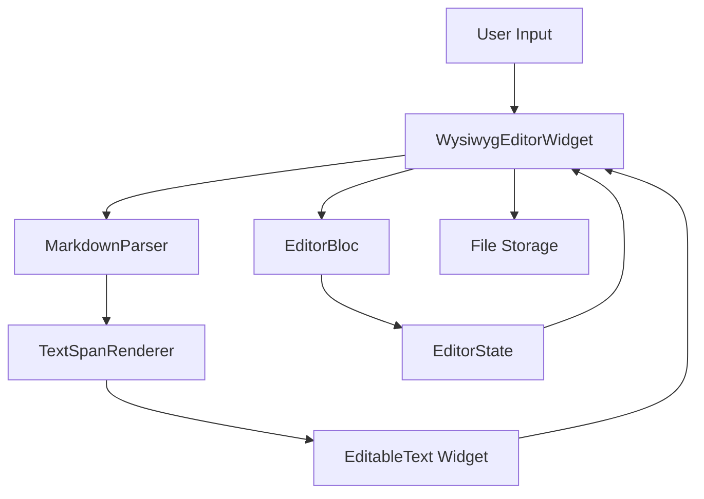
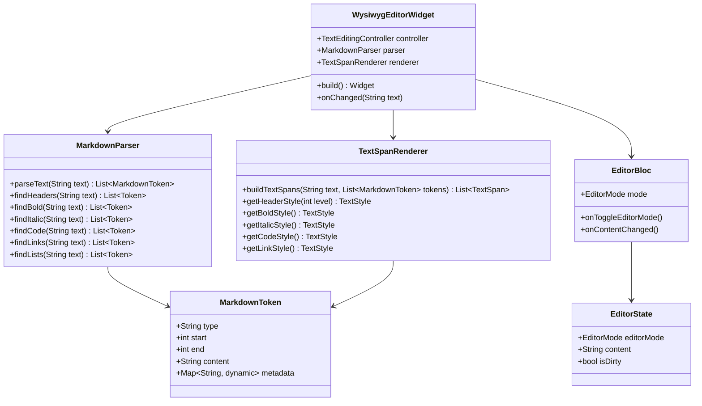

# WYSIWYG Markdown Editor Implementation Plan

## Overview
This document outlines the implementation of a WYSIWYG (What You See Is What You Get) markdown editing mode for the Asterisk Editor. The editor will render markdown syntax as styled text in real-time within the same editing pane, without requiring a split-screen preview.

## Architecture

### System Flow Diagram



### Component Architecture



## Implementation Steps

### 1. Create Markdown Parser Module

**File:** `lib/services/markdown_parser.dart`

The parser will identify markdown tokens using regex patterns:

| Markdown Syntax | Regex Pattern | Token Type |
|----------------|---------------|------------|
| Headers (H1-H6) | `^(#{1,6})\s+(.+)$` | `header` |
| Bold | `\*\*(.+?)\*\*` | `bold` |
| Italic | `(?<!\*)\*(?!\*)(.+?)(?<!\*)\*(?!\*)` | `italic` |
| Inline Code | `` `([^`]+)` `` | `code` |
| Links | `\[(.+?)\]\((.+?)\)` | `link` |
| Unordered Lists | `^[\-\*]\s+(.+)$` | `list_unordered` |
| Ordered Lists | `^\d+\.\s+(.+)$` | `list_ordered` |
| Strikethrough | `~~(.+?)~~` | `strikethrough` |

**Key Methods:**
- `List<MarkdownToken> parseText(String text)` - Main parsing method
- `List<MarkdownToken> findHeaders(String text)` - Find header tokens
- `List<MarkdownToken> findInlineStyles(String text)` - Find bold, italic, code tokens
- `List<MarkdownToken> findLinks(String text)` - Find link tokens
- `List<MarkdownToken> findLists(String text)` - Find list tokens

### 2. Create TextSpan Renderer

**File:** `lib/services/text_span_renderer.dart`

The renderer converts parsed tokens into Flutter TextSpan objects with appropriate styling.

**Style Definitions:**
```dart
// Header styles (H1-H6)
static const h1Style = TextStyle(fontSize: 32, fontWeight: FontWeight.bold);
static const h2Style = TextStyle(fontSize: 28, fontWeight: FontWeight.bold);
static const h3Style = TextStyle(fontSize: 24, fontWeight: FontWeight.bold);
// ... etc

// Inline styles
static const boldStyle = TextStyle(fontWeight: FontWeight.bold);
static const italicStyle = TextStyle(fontStyle: FontStyle.italic);
static const codeStyle = TextStyle(
  fontFamily: 'monospace',
  backgroundColor: Color(0xFFE0E0E0),
);
static const linkStyle = TextStyle(
  color: Colors.blue,
  decoration: TextDecoration.underline,
);
```

**Key Methods:**
- `List<TextSpan> buildTextSpans(String text, List<MarkdownToken> tokens)` - Build TextSpan tree
- `TextSpan createSpanForToken(MarkdownToken token, String content)` - Create styled span
- `void mergeOverlappingTokens(List<MarkdownToken> tokens)` - Handle nested/overlapping styles

### 3. Create WYSIWYG Editing Widget

**File:** `lib/pages/main_page/panes/wysiwyg_editing_pane.dart`

The widget extends `EditableText` to provide real-time markdown rendering.

**Key Features:**
- Real-time TextSpan rendering as user types
- Cursor position preservation during rendering
- Text selection handling
- Performance optimization (debounce rapid typing)

**Implementation Approach:**
```dart
class WysiwygEditorWidget extends StatefulWidget {
  final TextEditingController controller;
  final FocusNode focusNode;
  
  @override
  _WysiwygEditorWidgetState createState() => _WysiwygEditorWidgetState();
}

class _WysiwygEditorWidgetState extends State<WysiwygEditorWidget> {
  final MarkdownParser _parser = MarkdownParser();
  final TextSpanRenderer _renderer = TextSpanRenderer();
  Timer? _debounceTimer;
  
  @override
  Widget build(BuildContext context) {
    return EditableText(
      controller: widget.controller,
      focusNode: widget.focusNode,
      style: DefaultTextStyle.of(context).style,
      cursorColor: Theme.of(context).cursorColor,
      backgroundCursorColor: Colors.grey,
      textSpanBuilder: (context, value, {required style}) {
        return _buildStyledTextSpan(value.text);
      },
      // ... other EditableText properties
    );
  }
  
  TextSpan _buildStyledTextSpan(String text) {
    final tokens = _parser.parseText(text);
    return TextSpan(
      style: DefaultTextStyle.of(context).style,
      children: _renderer.buildTextSpans(text, tokens),
    );
  }
}
```

### 4. Integrate WYSIWYG Mode into EditorBloc

**Files to modify:**
- `lib/bloc/editor/editor_event.dart`
- `lib/bloc/editor/editor_state.dart`
- `lib/bloc/editor/editor_bloc.dart`

**Add EditorMode enum:**
```dart
enum EditorMode {
  plain,
  wysiwyg,
  preview,
}
```

**Add new event:**
```dart
class ToggleEditorMode extends EditorEvent {
  final EditorMode mode;
  const ToggleEditorMode(this.mode);
}
```

**Update EditorState:**
```dart
class EditorLoaded extends EditorState {
  final File currentFile;
  final String content;
  final bool isDirty;
  final EditorMode editorMode; // NEW
  
  const EditorLoaded({
    required this.currentFile,
    required this.content,
    this.isDirty = false,
    this.editorMode = EditorMode.plain, // NEW
  });
  
  @override
  List<Object?> get props => [currentFile.path, content, isDirty, editorMode];
  
  EditorLoaded copyWith({
    File? currentFile,
    String? content,
    bool? isDirty,
    EditorMode? editorMode, // NEW
  }) {
    return EditorLoaded(
      currentFile: currentFile ?? this.currentFile,
      content: content ?? this.content,
      isDirty: isDirty ?? this.isDirty,
      editorMode: editorMode ?? this.editorMode, // NEW
    );
  }
}
```

**Update EditorBloc:**
```dart
class EditorBloc extends Bloc<EditorEvent, EditorState> {
  // ... existing code
  
  EditorBloc() : super(const EditorInitial()) {
    on<LoadFileRequested>(_onLoadFileRequested);
    on<ContentChanged>(_onContentChanged);
    on<SaveFileRequested>(_onSaveFileRequested);
    on<ToggleEditorMode>(_onToggleEditorMode); // NEW
  }
  
  // NEW handler
  void _onToggleEditorMode(
    ToggleEditorMode event,
    Emitter<EditorState> emit,
  ) {
    if (state is EditorLoaded) {
      final currentState = state as EditorLoaded;
      emit(currentState.copyWith(editorMode: event.mode));
    }
  }
}
```

### 5. Update UI to Support Mode Switching

**File to modify:** `lib/pages/main_page/main_page.dart`

**Update mode list:**
```dart
final List<String> selectableModes = [
  'Split Pane',
  'Plain Editor',
  'WYSIWYG Editor',  // NEW
  'Preview Only',
];
```

**Update pane layout logic:**
```dart
Widget build(BuildContext context) {
  Widget fileBrowserPane = FileBrowserPaneWidget();
  Widget editorPane = EditingPaneWidget(
    editorScrollController: _editorScrollController,
    textEditingController: _textEditingController,
  );
  Widget wysiwygPane = WysiwygEditingPaneWidget(  // NEW
    controller: _textEditingController,
    focusNode: FocusNode(),
  );
  Widget previewPane = PreviewPaneWidget(
    previewScrollController: _previewScrollController,
  );

  _splitViewController = MultiSplitViewController(
    areas: (selectedMode == 'Split Pane') ? [
      Area(builder: (context, area) => fileBrowserPane, flex: 0.2, min: 0.1),
      Area(builder: (context, area) => editorPane, flex: 0.4, min: 0.1),
      Area(builder: (context, area) => previewPane, flex: 0.4, min: 0.1),
    ] : (selectedMode == 'Plain Editor') ? [
      Area(builder: (context, area) => fileBrowserPane, flex: 0.2, min: 0.1),
      Area(builder: (context, area) => editorPane, flex: 0.8, min: 0.1),
    ] : (selectedMode == 'WYSIWYG Editor') ? [  // NEW
      Area(builder: (context, area) => fileBrowserPane, flex: 0.2, min: 0.1),
      Area(builder: (context, area) => wysiwygPane, flex: 0.8, min: 0.1),
    ] : [
      Area(builder: (context, area) => fileBrowserPane, flex: 0.2, min: 0.1),
      Area(builder: (context, area) => previewPane, flex: 0.8, min: 0.1),
    ]
  );
  
  // ... rest of build method
}
```

**Add BlocListener to handle mode changes:**
```dart
@override
void initState() {
  super.initState();
  
  // Listen to EditorBloc for mode changes
  context.read<EditorBloc>().stream.listen((state) {
    if (state is EditorLoaded) {
      // Update mode dropdown based on state
      setState(() {
        selectedMode = _modeToString(state.editorMode);
      });
    }
    // ... existing listener code
  });
}

String _modeToString(EditorMode mode) {
  switch (mode) {
    case EditorMode.plain: return 'Plain Editor';
    case EditorMode.wysiwyg: return 'WYSIWYG Editor';
    case EditorMode.preview: return 'Preview Only';
  }
}
```

### 6. Create Markdown Formatting Toolbar (Optional)

**File:** `lib/widgets/markdown_toolbar.dart`

A toolbar with buttons to insert markdown syntax:

```dart
class MarkdownToolbar extends StatelessWidget {
  final TextEditingController controller;
  
  const MarkdownToolbar({required this.controller});
  
  @override
  Widget build(BuildContext context) {
    return Container(
      padding: EdgeInsets.all(8),
      child: Row(
        children: [
          _buildIconButton(Icons.format_bold, () => _insertMarkdown('**', '**')),
          _buildIconButton(Icons.format_italic, () => _insertMarkdown('*', '*')),
          _buildIconButton(Icons.code, () => _insertMarkdown('`', '`')),
          _buildIconButton(Icons.title, () => _insertMarkdown('# ', '')),
          _buildIconButton(Icons.link, () => _insertMarkdown('[', '](url)')),
          _buildIconButton(Icons.format_strikethrough, () => _insertMarkdown('~~', '~~')),
        ],
      ),
    );
  }
  
  void _insertMarkdown(String prefix, String suffix) {
    final selection = controller.selection;
    final text = controller.text;
    final selectedText = text.substring(selection.start, selection.end);
    controller.value = TextEditingValue(
      text: text.replaceRange(selection.start, selection.end, '$prefix$selectedText$suffix'),
      selection: TextSelection.collapsed(
        offset: selection.start + prefix.length + selectedText.length,
      ),
    );
  }
}
```

### 7. Markdown Syntax Persistence

**Key Considerations:**
- The underlying text in `TextEditingController` always contains raw markdown
- Only the visual representation is styled via TextSpan
- When saving files, the raw markdown is preserved
- When loading files, markdown is parsed and rendered

**Implementation:**
```dart
// In WysiwygEditorWidget
void _handleTextChange(String newText) {
  // newText contains raw markdown
  // TextSpan rendering happens automatically via textSpanBuilder
  // No conversion needed - markdown is always preserved
  context.read<EditorBloc>().add(ContentChanged(newText));
}
```

## Technical Challenges and Solutions

### Challenge 1: Cursor Position During Rendering
**Problem:** Rebuilding TextSpans can cause cursor jumps.

**Solution:**
- Store cursor position before rendering
- Restore cursor position after rendering
- Use `EditableText`'s built-in cursor management

### Challenge 2: Nested Markdown Patterns
**Problem:** Handling `**bold with _italic_**` correctly.

**Solution:**
- Parse tokens in order of specificity (inline code first, then bold, then italic)
- Merge overlapping tokens
- Use TextSpan nesting for nested styles

### Challenge 3: Performance with Large Documents
**Problem:** Parsing and rendering on every keystroke can be slow.

**Solution:**
- Implement debouncing (300-500ms delay)
- Only re-parse changed portions of text
- Cache parsed tokens when possible

### Challenge 4: Text Selection in Styled Text
**Problem:** Selecting text that spans multiple styled spans.

**Solution:**
- `EditableText` handles this natively
- Ensure TextSpan tree structure is correct
- Test selection behavior thoroughly

## Testing Strategy

1. **Unit Tests for Parser**
   - Test each markdown pattern individually
   - Test multiple patterns in same text
   - Test edge cases (empty strings, special characters)

2. **Unit Tests for Renderer**
   - Verify TextSpan generation
   - Check style application
   - Test nested styles

3. **Widget Tests for WysiwygEditorWidget**
   - Test rendering with various markdown
   - Test cursor behavior
   - Test text selection

4. **Integration Tests**
   - Test mode switching
   - Test file save/load with WYSIWYG mode
   - Test toolbar functionality

## File Structure

```
lib/
├── bloc/
│   └── editor/
│       ├── editor_bloc.dart        (MODIFIED)
│       ├── editor_event.dart       (MODIFIED)
│       └── editor_state.dart       (MODIFIED)
├── pages/
│   └── main_page/
│       ├── main_page.dart          (MODIFIED)
│       └── panes/
│           ├── editing_pane.dart   (UNCHANGED)
│           ├── wysiwyg_editing_pane.dart  (NEW)
│           ├── file_browser_pane.dart (UNCHANGED)
│           └── preview_pane.dart   (UNCHANGED)
├── services/
│   ├── markdown_parser.dart        (NEW)
│   └── text_span_renderer.dart     (NEW)
└── widgets/
    └── markdown_toolbar.dart       (NEW - optional)
```

## Dependencies

No new dependencies required - uses only Flutter core packages:
- `flutter` (for TextSpan, EditableText, etc.)
- `flutter_bloc` (already in project)
- `equatable` (already in project)

## Future Enhancements

1. Support for blockquotes
2. Support for code blocks with syntax highlighting
3. Support for tables
4. Support for task lists
5. Auto-completion for markdown syntax
6. Keyboard shortcuts for formatting
7. Theme customization for markdown styles
8. Export to HTML/PDF
